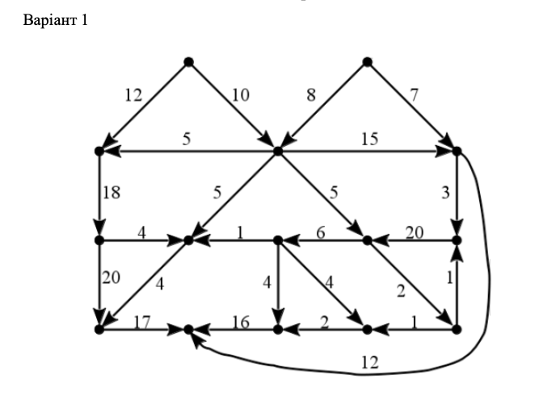

### Паркування, покриття, правильне розфарбування графу.

**Мета роботи:** закріпити теоретичні знання та здобути практичні навики по темі «паркування, покриття, правильне розфарбування графу».

**Завдання:**
Для графу відповідно **варіанту 1**
1. Визначити та зобразити графічно (вручну) реберне та вершинне покриття графа.
2. Розробити програму для визначення реберного та вершинного покриття графа.
3. Розробити програму правильного розфарбування графа.
4. Відповісти на контрольні запитання.

#### Варіант 1
