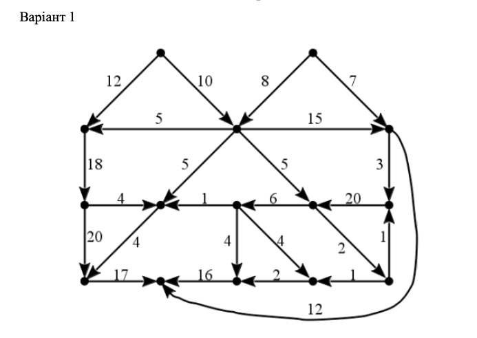

### Цикли та коцикли графу.

**Мета роботи:** закріпити теоретичні знання та здобути практичні навички з теми «Цикли та коцикли графа».

**Завдання:**

**Варіант 1**

Розглядати граф як неорієнтований

- Визначити цикломатичне число графа.
- Записати матрицю циклів у формі C = (C₁ | C₂).
- Записати матрицю коциклів у формі K = (K₁ | K₂).
- Перевірити виконання умови ортогональності C ⋅ Kᵀ = 0.
- Зобразити фундаментальну систему коциклів (розрізів).
- Відповісти на контрольні запитання.

**Контрольні запитання**
1. Що таке цикломатичне число графа і як його обчислити?
2. Як формується матриця циклів графа?
3. Що відображає матриця коциклів графа?
4. Як перевірити ортогональність матриць циклів і коциклів?
